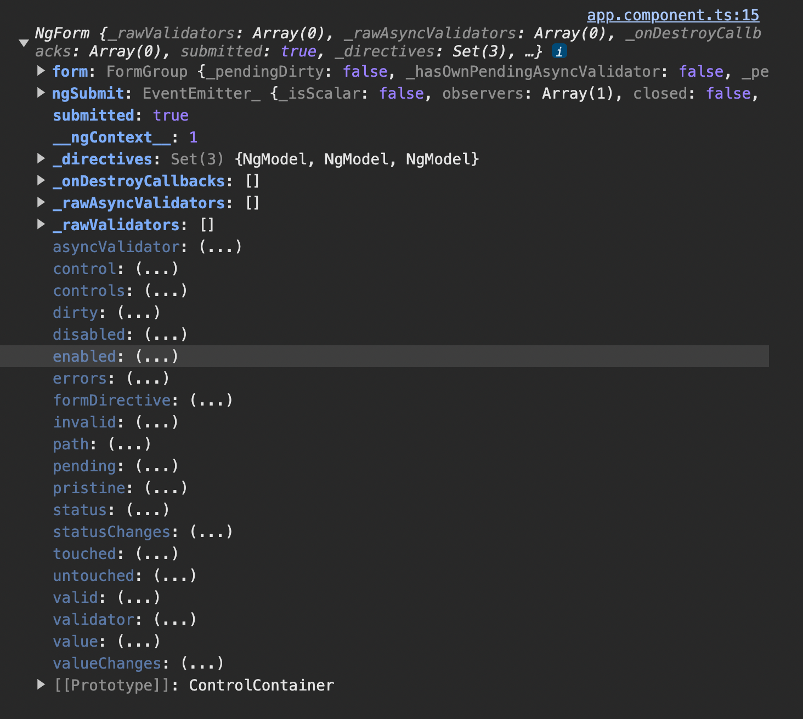
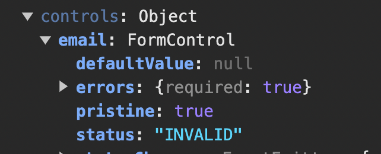

# Angular and Forms

Angular gives us the JavaScript Object representation(JSON) of the form making simple for the developer
to receive user values and to see the state of the form and to work with it.

```html

<form>
  <label>Name</label>
  <input type="text" name="name">
  <label>Mail</label>
  <input type="text" name="email">
  <button type="submit">Save</button>
</form>
```

JSON notation of the above form

```javascript
{
    value:{
        name: 'Sai',
            email
    :
        'test@gmail.com'

    }
}
```

## Creating the Form and registering the controls

```html

<div class="container">
  <div class="row">
    <div class="col-xs-12 col-sm-10 col-md-8 col-sm-offset-1 col-md-offset-2">
      <form>
        <div id="user-data">
          <div class="form-group">
            <label for="username">Username</label>
            <input type="text"
                   id="username"
                   class="form-control">
          </div>
          <button class="btn btn-default" type="button">Suggest an Username</button>
          <div class="form-group">
            <label for="email">Mail</label>
            <input type="email"
                   id="email"
                   class="form-control">
          </div>
        </div>
        <div class="form-group">
          <label for="secret">Secret Questions</label>
          <select id="secret"
                  class="form-control">
            <option value="pet">Your first Pet?</option>
            <option value="teacher">Your first teacher?</option>
          </select>
        </div>
        <button class="btn btn-primary" type="submit">Submit</button>
      </form>
    </div>
  </div>
</div>

```

Angular can not by default convert every html element to JSON which is inside the `form tag`. That is because, in some
cases we may not need everything to be as part of JSON object.

> which ever the HTML element we wanted to add in the JavaScript Object is referred to `control`.

To make an input visible to Angular, add the attributes `ngModel` and `name`

```html
<input type="text"
       id="username"
       class="form-control"
       ngModel
       name="username">

<input type="email"
       id="email"
       class="form-control"
       ngModel
       name="email">

<select id="secret"
        class="form-control"
        ngModel
        name="secret">
```

we made all the 3 elements in our HTML page to be controlled.

`ngModel` --> On adding ngModel alone, Angular assumes that, Okay this input is part of Javascript Object representation
of the form.

`name` --> with this step we give the name to the control. The name we gave is `username` in the above example.

## Submitting and using the form

```html

<form (ngSubmit)="onSubmit(f)" #f="ngForm">
</form>
```

```typescript
onSubmit(form
:
NgForm
)
{
    console.log(form);
}
```

onSubmit will be called on submitting the form where, we passed the local reference of type ngForm as an argument to the
method.

## Form state

We can see a lot of properties being printed as part of ngForm where we can see the controls we registered and many
other properties like isDirty, errors, valid, touched(if we have clicked any button) any may more.


## Accessing the form with @ViewChild

```typescript
@ViewChild('f')
signUpForm
:
NgForm;

suggestUserName()
{
    const suggestedName = 'Superuser';
}

onSubmit()
{
    console.log(this.signUpForm);
}
```

## Adding validation to check input

```html
<input type="text"
       id="username"
       class="form-control"
       ngModel
       name="username"
       required>

<input type="email"
       id="email"
       class="form-control"
       ngModel
       name="email"
       required
       email>
```

> we can call those required and email as directives

later adding the above validations and submitting without entering any data



here are the few references

1. https://angular.io/api/forms/Validators
2. https://angular.io/api?type=directive

## Using the form states

# Disabling submit button while the form is invalid

```html

<button class="btn btn-primary"
        type="submit"
        [disabled]="!f.valid">
  Submit
</button>
```

f is the local template reference of the form.

# Enable red border to the invalid fields.

Let's make our field's border red, while invalid but later on touching hte field.

We can use the built-in help css classes

```css
input.ng-invalid.ng-touched {
    border: 1px solid red;
}
```

## Outputting validation error messages

using a local reference and ngModel.

```html
<input type="text"
       id="username"
       class="form-control"
       ngModel
       name="username"
       required
       #name="ngModel">
<p *ngIf="!name.valid && name.touched">Please enter the name</p>
```

## Set default values ngModel propertyBinding

```html
<select id="secret"
        class="form-control"
        ngModel
        name="secret"
        [ngModel]="defaultSecurityOption">
  <option value="pet">Your first Pet?</option>
  <option value="teacher">Your first teacher?</option>
</select>
```

```typescript
defaultSecurityOption:string = 'pet';
```

With [ngModel] the `value` of the control is bound. The option with the value pet is chosen in this way:

<option value="pet">Your first Pet?</option>

## using ngModel with 2 way binding


```html
<div class="form-group">
          <label>Description</label>
          <textarea name="description"
                    rows="3"
                    class="form-control"
                    ngModel
                    [(ngModel)]="description">
          </textarea>
          Your description: {{description}}
        </div>
```

# usages of ngModel in forms

## no binding
ngModel with no binding is to tell angular that input is a control.

## one-way binding
This is to give the input a default value.

## Two-way binding

To instantly output the value to do what ever we want to do with that value.

============================================================

## Setting and patching form values

let's see how to patch the values to the form from ts code.

```typescript
 @ViewChild('f')
signUpForm: NgForm;

suggestUserName() {
    const suggestedName: string = 'Superuser';
    this.signUpForm.form.patchValue({
        username: suggestedName // ---> 1
    });
}
```

```html
<input type="text"
       id="username"
       class="form-control"
       ngModel
       name="username" // ---> 2
       required
       #name="ngModel">
```

The username must match with the name of the input field. 1 and 2 must match.

## Using From Data

Let's try printing the form data user submitted

```typescript
isFormSubmitted: boolean = false;
@ViewChild('f')
signUpForm: NgForm;
user: { name: string, mail: string, secretQuestion: string, description: string, gender: string };

onSubmit() {
    this.isFormSubmitted = true;
    console.log(this.signUpForm);
    this.user = {
      name: this.signUpForm.value.username,  // --> 1
      mail: this.signUpForm.value.email,
      secretQuestion: this.signUpForm.value.secret,
      description: this.signUpForm.value.description,
      gender: this.signUpForm.value.gender
    }
    console.log(this.user);
  }
```

```html
<div class="row">
  <div class="col-xs-12">
    <div *ngIf="isFormSubmitted">
      <h3>Your data</h3>
      <p>userName: {{user.name}}</p>
      <p>Email: {{user.mail}}</p>
      <p>Gender: {{user.gender}}</p>
      <p>Description: {{user.description}}</p>
      <p>Security Question: {{user.secretQuestion}}</p>
    </div>
  </div>
</div>
```

> the names must be double-checked with the name we give to the input controls,  in 1.