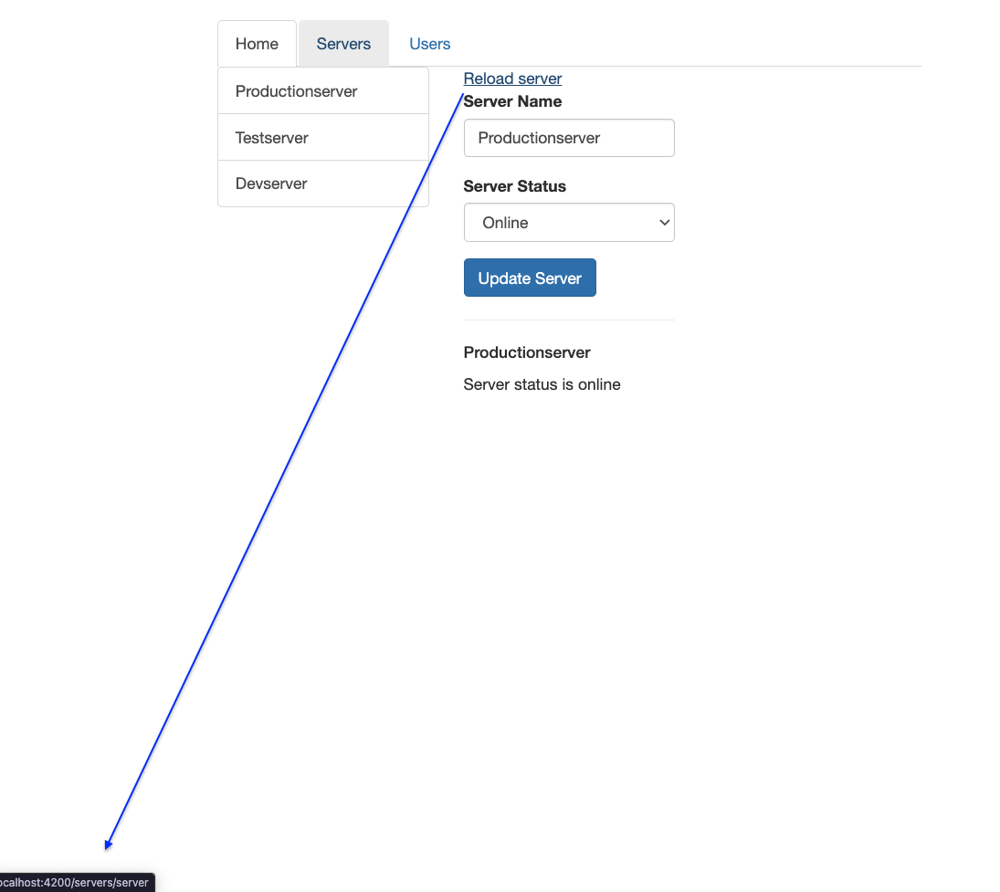
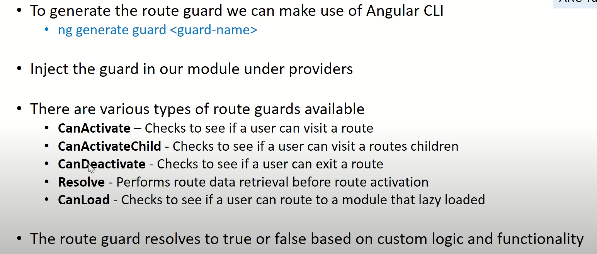

# Angular routes

Routes helps in switching between the pages. In other words, We bring a specific component on to the page through the routes.

We associate a path to each component in the app.module.ts

Thi's is how typically the app.module.ts looks like

```typescript
@NgModule({
    declarations: [
        AppComponent,
        HomeComponent,
        UsersComponent,
        ServersComponent,
        UserComponent,
        EditServerComponent,
        ServerComponent
    ],
    imports: [
        BrowserModule,
        FormsModule,
    ],
    providers: [ServersService],
    bootstrap: [AppComponent]
})
export class AppModule { }
```

Now lets define our routes

```typescript
const appRoutes: Routes = [
    {path: '', component: HomeComponent},
    {path: 'users', component: UsersComponent},
    {path: 'servers', component: ServersComponent}
];

@NgModule({
    declarations: [
        AppComponent,
        HomeComponent,
        UsersComponent,
        ServersComponent,
        UserComponent,
        EditServerComponent,
        ServerComponent
    ],
    imports: [
        BrowserModule,
        FormsModule,
        RouterModule.forRoot(appRoutes)
    ],
    providers: [ServersService],
    bootstrap: [AppComponent]
})
export class AppModule { }
```

In order to let angular know which component has to be called on calling which path, we define those in Routes like shown in hte above example.

> HomeComponent path is left empty, that is just to make it the default path that means, `localhost:4200` is the default URL loaded and some page has to show up which is Home component in our case by making it empty.

We are not yet done, we just declared the routes however, they need to get registered somewhere and that place is `RouterModule in imports`.

```typescript
imports: [
        BrowserModule,
        FormsModule,
        RouterModule.forRoot(appRoutes)
    ]
```

## Rendering

As we registered our routes, we now don't right away call the component by its name ex: `<app-server></app-server>` we 
instead call `<router-outlet></router-outlet>` which is a `directive`.

## Navigating with routerLinks

So, we declared and registered our routes and used `<router-outlet></router-outlet>` to switch between pages and there's one last step 
yet to be done which is by giving routerLinks.

> In Angular, routerLink is typically used inside the anchor `<a></a>`  tag to create navigation links

``` html
<ul class="nav nav-tabs">
  <li role="presentation" class="active"><a routerLink="/">Home</a></li>
  <li role="presentation"><a routerLink="/servers">Servers</a></li>
  <li role="presentation"><a [routerLink]="['/users']" >Users</a></li>
</ul>
```

Another way of using routerLink is by propertyBinding used for `/users` in the above code snippet. 
If we right away write the path inside " " after declaring routerLink inside [], angular will search for that variable in ts file which is wrong so we again define it as a string.

> `[routerLink]="/users"` --> angular searches for /users variable in ts file. So, we make it a string `[routerLink]="'/users'"`

To make it simpler when we need to attach multiple routes we enclose it in between array again `[routerLink]="['/users']"`
for example `[routerLink]="['/users','user']"` now the path is `/users/user`.

## Navigation Paths

when a path is appended with `/` then it appends it to the root domain which is an `absolute path`. Relative path is which without `/` or with `./` .

Example `/users` is `absolute path`  and `users or ./users` is `relative path`

# Relative Path

`Relative path appends the path we define to the end of current path`. For example in this specific module try to add a link in the serves component.

```HTML
 <a routerLink="server">Reload server</a>
```

below image show how it looks and the URL as well on hovering the server in the servers component.


# Absolute Path

To make it absolute(something with appends to the root domain) simply append `/` infront of the routerLink

```HTML
 <a routerLink="/server">Reload server</a>
```


## Styling active route links

```html
<ul class="nav nav-tabs">
        <li role="presentation"
            routerLinkActive="active"
            [routerLinkActiveOptions]="{exact: true}">
          <a routerLink="/">Home</a>
        </li>
        <li role="presentation"
            routerLinkActive="active">
          <a routerLink="/servers">Servers</a>
        </li>
        <li role="presentation"
            routerLinkActive="active">
          <a [routerLink]="['/users']">Users</a>
        </li>
</ul>
```
adding `routeLinkActive` directive helps to only highlight the selected link

> `[routerLinkActiveOptions]="{exact: true}"` is only given to the empty path `''` this is because, the angular search if the path is in the link. Since empty path that is '/' is almost available in all the links the home section in our example always gets highlighted.
> So to overcome this we tell angular to only highlight when that specific path is only searched.

## Navigate programmatically

In case we like to navigate to server page from the home page by clicking a button in hte home page, below steps need to be followed.

// home.component.html
```html
<button class="btn btn-success" (click)="onRedirecting()">Redirect to server</button>
```
//home.component.ts

```typescript
constructor(private router: Router) {
}

onRedirecting(): void {
    this.router.navigate(['/servers']);
}
```

## Passing Parameters to Routes

In our example code we also have UsersConponent inside UserComponent, and the userComponent has the userdetails with id.
lets create a route to accept parameter to access usersComponent.

Later in the further examples we'll see how to fetch the value entred in the path and return the used based on thet.

```typescript
const appRoutes: Routes = [
    {path: 'users/:id', component: UserComponent}
];
```

now we will be able to fetch the UsersComponent with the path `localhost:4200/users/1`.

## Fetching route parameters

In this step let's pass another parameter name ot the UsersComponent so the Routes in the app.module.ts looks like 

```typescript
const appRoutes: Routes = [
    {path: 'users/:id:/name', component: UserComponent}
];
```

```typescript
export class UserComponent implements OnInit {
    public user: { id: number, name: string };

    constructor(private activatedRoute: ActivatedRoute) {
    }

    ngOnInit() {
        this.activatedRoute.params
            .subscribe(
                (params: Params): void => {
                    this.user = {
                        id: params['id'],
                        name: params['name']
                    }
                }
            );
    }
}
```

We here have an user object to hold id and name. In order to fetch the parameters in the path we need to get hold of 
current active route which is provided by `ActivatedRoute`.

The reason behind the below code inside subscribe
```typescript
(params: Params): void => {
                    this.user = {
                        id: params['id'],
                        name: params['name']
                    }
                }
```
we may have right away set the values using `user.id = ` instead of accessing the object and setting them like in the above code.

> The reason is user is not initialized but just declared.

## creating a routeLink in html page

Let's create a route link just like we declare in the app.module.ts `path: 'users/:id:/name'`

```html
<a routerLink="['/user',10,'sai]">User Details</a>
// which is similar to `/user/10/sai`
```

## Passing QueryParams and Fragments

We generally crate links with the routerLink and to append a query parameter to the path we something similar to router link that is queryParams

```html
<a
[routerLink]="['/servers',5,'edit']"
[queryParams]="{allowEdit:'1'}"
href="#"
class="list-group-item"
*ngFor="let server of servers">
{{ server.name }}
</a>
```

On clicking any one of the server in the list the path would be `http://localhost:4200/servers/5/edit?allowEdit=1` 

`Fragment` is also one such thing like queryParam we rarely use  

```html
<a
[routerLink]="['/servers',5,'edit']"
[queryParams]="{allowEdit:'1'}"
fragmant="loadinh"
href="#"
class="list-group-item"
*ngFor="let server of servers">
{{ server.name }}
</a>
```

Here is the complete path later adding the fragment `http://localhost:4200/servers/5/edit?allowEdit=1#loading`

## setting queryParams and fragments programmatically

We added a button earlier to redirect to server page form home page, let's use that now.

```html
<button class="btn btn-success" (click)="onLoadServer(1)">Load server 1</button>
```

```typescript
  public onLoadServer(id: number): void {
    this.router.navigate(['/servers', id, 'edit'], {queryParams: {allowEdit: '1'}, fragment: 'loading'});
  }
```

## Fetching queryParams and fragments

```typescript
constructor(private route: ActivatedRoute) {
}

ngOnInit() {
    this.route.queryParams.subscribe((queryParams) => console.log(queryParams));
    this.route.fragment.subscribe((fragments) => console.log(fragments));
}
```

## {relativeTo: this.route}

For suppose we are calling below method on a button click

```typescript
public onEditServer(): void {
    this.router.navigate(['/servers', this.server.id, 'edit']);
  }
```
Look at the path, we are supposed to navigate to servers `/servers/id/edit`

If we are already in the /servers/id then we can used the absolute path instead of relative path.

```typescript
public onEditServer(): void {
    this.router.navigate(['edit'],{relativeTo:this.route});
  }
```

## Redirecting wildcard routes

When an user accedentally type some wrong URL we should intimate the user that he entred wrong path. So, lets create a component and use that for all the incorrect paths.

```typescript
  {path: '**', component: PageNotFoundComponent}
```

we add the above line in Routes inside app.module.ts. `**` automatically catches all the wrong paths.

## Route Guards

> 

